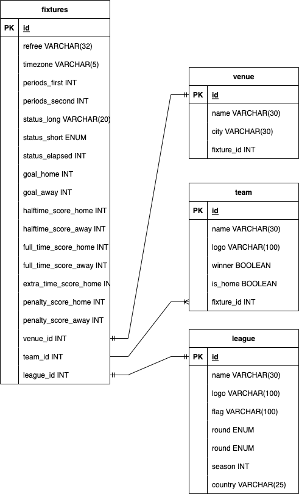

# Technical stack
1. Nodejs version 16
2. NestJs version 8
3. Mysql (standalone installed by docker)
4. TypeORM: Lib to handle Object Relation Mapping for interacting with database as well UI for developer
5. Docker: Support for build and package is easy
6. NPM: Dependency management repository. It's help for managing installed lib in nodejs
Notes: All of tech stack
7. Swagger: Create API documents for application
# Database design

**Figure 1**. fuxtures database
## fixtures
Managing all info regarding match as refree, start time, end time, goal. It's will be updated
realtime in real application. In scope of assignment, I assumed that it will not be
handled for realtime info
## team
Managing all info regarding of football club. It's a short info name, logo etc
## league
Manging all info regarding league
## venue
Managing stadium info as name, city where allocated stadium 
# API design
After launching successfully application. Please access to link
```
http://localhost:3000/api
```
you will see the UI as figure 2

# How to run application
## Prepare environment
1. Install docker: the first, docker will be installed
2. Install Mysql via docker as below command
```
docker pull mysql // get mysql official from docker registry
docker run --name mysql -e MYSQL_ROOT_PASSWORD=fixtures -d mysql
```
3. Install nodejs 16: It's required
4. Install nestjs via npm
5. Build dockerfile as below command
```
docker build -t fixtures:1.0 . // Build docker image
docker run --name fixtures -p 3000:3000 -d fitures:1.0
```
# Seed data
before running application. Please run API
```
curl --location --request POST 'http://localhost:3000/v1/fixtures' \
--header 'Content-Type: application/json' \
--data-raw '[
    {
        "fixture": {
            "referee": null,
            "timezone": "UTC",
            "date": "2023-01-11T14:00:00+00:00",
            "timestamp": 1673464014,
            "periods": {
                "first": 1673464014,
                "second": null
            },
            "venue": {
                "name": "Old Trafford",
                "city": "Manchester"
            },
            "status": {
                "long": "Halftime",
                "short": "HT",
                "elapsed": 45
            }
        },
        "league": {
            "name": "English Premier League",
            "country": "England",
            "logo": "https://www.pngall.com/wp-content/uploads/4/Premier-League-PNG-Clipart.png",
            "flag": "https://www.crwflags.com/FoTW/images/g/gb@fae2.gif",
            "season": 2023,
            "round": "Regular Season - 1"
        },
        "teams": {
            "home": {
                "name": "Manchester United",
                "logo": "https://seeklogo.com/images/M/manchester-united-logo-F14DA1FCCD-seeklogo.com.png",
                "winner": false
            },
            "away": {
                "name": "liverpool FC",
                "logo": "https://upload.wikimedia.org/wikipedia/vi/thumb/0/0c/Liverpool_FC.svg/350px-Liverpool_FC.svg.png",
                "winner": true
            }
        },
        "goals": {
            "home": 0,
            "away": 2
        },
        "score": {
            "halftime": {
                "home": 0,
                "away": 1
            },
            "fulltime": {
                "home": 0,
                "away": 2
            },
            "extratime": {
                "home": null,
                "away": null
            },
            "penalty": {
                "home": null,
                "away": null
            }
        }
    },
    {
        "fixture": {
            "referee": null,
            "timezone": "UTC",
            "date": "2023-01-11T14:00:00+00:00",
            "timestamp": 1673464014,
            "periods": {
                "first": 1673464014,
                "second": null
            },
            "venue": {
                "name": "Old Trafford",
                "city": "Manchester"
            },
            "status": {
                "long": "Halftime",
                "short": "HT",
                "elapsed": 45
            }
        },
        "league": {
            "name": "English Premier League",
            "country": "England",
            "logo": "https://www.pngall.com/wp-content/uploads/4/Premier-League-PNG-Clipart.png",
            "flag": "https://www.crwflags.com/FoTW/images/g/gb@fae2.gif",
            "season": 2023,
            "round": "Regular Season - 1"
        },
        "teams": {
            "home": {
                "name": "Manchester United",
                "logo": "https://seeklogo.com/images/M/manchester-united-logo-F14DA1FCCD-seeklogo.com.png",
                "winner": false
            },
            "away": {
                "name": "liverpool FC",
                "logo": "https://upload.wikimedia.org/wikipedia/vi/thumb/0/0c/Liverpool_FC.svg/350px-Liverpool_FC.svg.png",
                "winner": true
            }
        },
        "goals": {
            "home": 0,
            "away": 2
        },
        "score": {
            "halftime": {
                "home": 0,
                "away": 1
            },
            "fulltime": {
                "home": 0,
                "away": 2
            },
            "extratime": {
                "home": null,
                "away": null
            },
            "penalty": {
                "home": null,
                "away": null
            }
        }
    },
    {
        "fixture": {
            "referee": null,
            "timezone": "UTC",
            "date": "2023-01-11T14:00:00+00:00",
            "timestamp": 1673464014,
            "periods": {
                "first": 1673464014,
                "second": null
            },
            "venue": {
                "name": "Old Trafford",
                "city": "Manchester"
            },
            "status": {
                "long": "Halftime",
                "short": "HT",
                "elapsed": 45
            }
        },
        "league": {
            "name": "English Premier League",
            "country": "England",
            "logo": "https://www.pngall.com/wp-content/uploads/4/Premier-League-PNG-Clipart.png",
            "flag": "https://www.crwflags.com/FoTW/images/g/gb@fae2.gif",
            "season": 2023,
            "round": "Regular Season - 1"
        },
        "teams": {
            "home": {
                "name": "Manchester United",
                "logo": "https://seeklogo.com/images/M/manchester-united-logo-F14DA1FCCD-seeklogo.com.png",
                "winner": false
            },
            "away": {
                "name": "liverpool FC",
                "logo": "https://upload.wikimedia.org/wikipedia/vi/thumb/0/0c/Liverpool_FC.svg/350px-Liverpool_FC.svg.png",
                "winner": true
            }
        },
        "goals": {
            "home": 0,
            "away": 2
        },
        "score": {
            "halftime": {
                "home": 0,
                "away": 1
            },
            "fulltime": {
                "home": 0,
                "away": 2
            },
            "extratime": {
                "home": null,
                "away": null
            },
            "penalty": {
                "home": null,
                "away": null
            }
        }
    },
    {
        "fixture": {
            "referee": null,
            "timezone": "UTC",
            "date": "2023-01-11T14:00:00+00:00",
            "timestamp": 1673464014,
            "periods": {
                "first": 1673464014,
                "second": null
            },
            "venue": {
                "name": "Old Trafford",
                "city": "Manchester"
            },
            "status": {
                "long": "Halftime",
                "short": "HT",
                "elapsed": 45
            }
        },
        "league": {
            "name": "English Premier League",
            "country": "England",
            "logo": "https://www.pngall.com/wp-content/uploads/4/Premier-League-PNG-Clipart.png",
            "flag": "https://www.crwflags.com/FoTW/images/g/gb@fae2.gif",
            "season": 2023,
            "round": "Regular Season - 1"
        },
        "teams": {
            "home": {
                "name": "Manchester United",
                "logo": "https://seeklogo.com/images/M/manchester-united-logo-F14DA1FCCD-seeklogo.com.png",
                "winner": false
            },
            "away": {
                "name": "liverpool FC",
                "logo": "https://upload.wikimedia.org/wikipedia/vi/thumb/0/0c/Liverpool_FC.svg/350px-Liverpool_FC.svg.png",
                "winner": true
            }
        },
        "goals": {
            "home": 0,
            "away": 2
        },
        "score": {
            "halftime": {
                "home": 0,
                "away": 1
            },
            "fulltime": {
                "home": 0,
                "away": 2
            },
            "extratime": {
                "home": null,
                "away": null
            },
            "penalty": {
                "home": null,
                "away": null
            }
        }
    }
]'
```